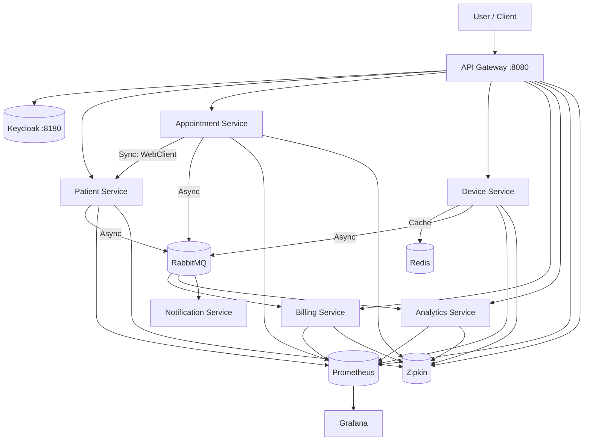

# SmartHealth Platform – Event-Driven Architecture

> Context file for AI-assisted development (Gemini CLI).
> Keep this document updated whenever architecture, technologies, or event contracts change.

---

## 1) Overview
SmartHealth is a training/reference project that demonstrates a production-grade, **event-driven microservices** platform for healthcare.  
Primary goals: **EDA with Sagas & Outbox**, **resilience**, **Observability**, and **memory-optimized deployment**.

---

## 2) Key Features
- Patient registration & management.
- Appointment scheduling with patient verification (WebClient).
- Automated billing based on booked appointments.
- Multi-channel notifications.
- Device telemetry ingestion (Redis cache + RabbitMQ event flow).
- **Health Analytics**: Historical trends, Average/Max heart rate calculation, and recent readings history stored in PostgreSQL.
- **Full Observability** (JVM Metrics + Dashboards + Distributed Tracing).

---

## 3) Microservices & Infrastructure
1. **API Gateway** (8080) — Spring Cloud Gateway (Demo Mode: Open Access).
2. **Patient Service** (8081) — Patient CRUD.
3. **Appointment Service** (8082) — Scheduling logic.
4. **Billing Service** (8083) — Invoice generation.
5. **Notification Service** (8084) — SMS/Email simulation.
6. **Device Service** (8085) — Telemetry ingestion (Redis).
7. **Analytics Service** (8086) — Historical data & stats (PostgreSQL).
8. **Keycloak** (8180) — OIDC Server (Available for future use).
9. **Prometheus** (9090) — Metrics collection.
10. **Grafana** (3000) — Metrics visualization (Admin: admin/admin).
11. **Zipkin** (9411) — Distributed Tracing.

---

## 4) Event Flow (RabbitMQ - internal.exchange)
- `patient.created`: Sent by Patient Service.
- `appointment.booked`: Sent by Appointment Service -> Consumed by Billing.
- `device.telemetry.update`: Sent by Device Service -> Consumed by Analytics.

---

## 5) Tech Stack
- **Backend**: Java 21 (LTS), Spring Boot 3.4.x, Spring Cloud Gateway.
- **Security**: OAuth2 Resource Server (Currently in Demo Mode - permitAll).
- **Observability**: Micrometer, Prometheus, Grafana, Zipkin.
- **Data**: PostgreSQL, Redis.
- **Messaging**: RabbitMQ.
- **Orchestration**: **Docker Compose ONLY** (No Kubernetes/K8S/K3S support).
- **Deployment**: Local Docker environment with resource-constrained containers.

---

## 6) Architecture Diagram (Mermaid)

---

## 7) Memory Optimization Rules
- **Docker Limits**: 
    - Microservices: **256MB - 300MB** RAM.
    - API Gateway: **512MB** RAM.
- **JVM Limits**: `-Xmx192m -Xms128m` (Gateway: `-Xmx384m`).
- **Resilience**: All services have `restart: on-failure` to handle dependency startup lags.

---

## 8) Quick Start (Optimized)
1. Build all services: `./mvnw clean package -DskipTests`
2. Start infrastructure & apps: `docker compose up --build -d`
3. **Test Telemetry**: Run the simulator to feed data into Redis: `./infra/simulator.sh`
4. Access:
    - Frontend Dashboard: `http://localhost:4200`
    - API Gateway: `http://localhost:8080`
    - Grafana: `http://localhost:3000` (Admin: admin/admin)
    - Zipkin: `http://localhost:9411`

---

## 9) Architectural Decisions & Design Patterns
- **Demo Mode**: To ensure local development stability and ease of testing, the platform currently operates in "Demo Mode" with open access. OIDC redirection is disabled in the UI.
- **Telemetry Polling**: The `Device Service` returns `200 OK` with a `null` body (instead of `404`) when no data is found in Redis. The Frontend handles this by displaying a "Waiting for sensor..." message.
- **Analytics Ingestion**: `Analytics Service` consumes telemetry events from RabbitMQ and persists them in PostgreSQL for historical reporting and trend analysis.

---

## 10) Maintenance & AI Directives
- **CRITICAL**: If the architecture, data flow, or service structure changes, **this file MUST be updated immediately**.
- **Always provide shell commands in a single line** (no backslashes).
- Do not commit changes automatically, only commit when explicitly requested by the user.
- **Use English** for all code, comments, and documentation updates.

---

## 11) Observability Setup
- **Zipkin**: Distributed tracing enabled via `sh-zipkin:9411`. Traces are propagated across all microservices using Micrometer Tracing.
- **Grafana Provisioning**: Automated setup for Prometheus datasource and JVM dashboards.
- **Dashboards**: Accessible at `http://localhost:3000`. Use 'JVM (Micrometer)' dashboard for real-time monitoring.

---

## 12) Testing Strategy
The platform implements a comprehensive testing pyramid designed for fast, reliable CI/CD execution:

- **Unit Testing (Java)**: Coverage for all Services, Controllers, and Listeners using JUnit 5 and Mockito.
    - Run via `./mvnw verify` in the root directory (recommended to ensure stub generation).
- **Unit Testing (Angular)**: Migrated to **Jest 30** with **JSDOM** for fast, headless execution.
    - Uses Angular 21.1.x aligned dependencies.
    - Run via `npm test` in the `web-ui` directory using `--legacy-peer-deps`.
- **Integration Testing (IT)**: Docker-based tests using **Testcontainers**.
    - Ephemeral PostgreSQL, RabbitMQ (added to Patient Service), and Redis instances are automatically managed.
    - Verifies database schemas, event publishing/consumption, and cross-service WebClient calls.
- **Contract Testing**: Implemented using **Spring Cloud Contract**.
    - **Isolation**: Contract tests use **H2 in-memory database** to eliminate PostgreSQL dependency in CI.
    - **Messaging**: Services use a **RabbitMQ-to-Spring-Integration bridge** in `ContractVerifierBase` to test events without a broker.
    - **Resolution**: Stubs are resolved via `CLASSPATH` mode for reliable multi-module CI builds.
- **CI/CD Pipeline**:
    - Build command: `./mvnw clean verify` (ensures stubs are available for dependent tests).
    - Artifacts: Automated upload of `surefire-reports` and `failsafe-reports` on build failure for rapid debugging.