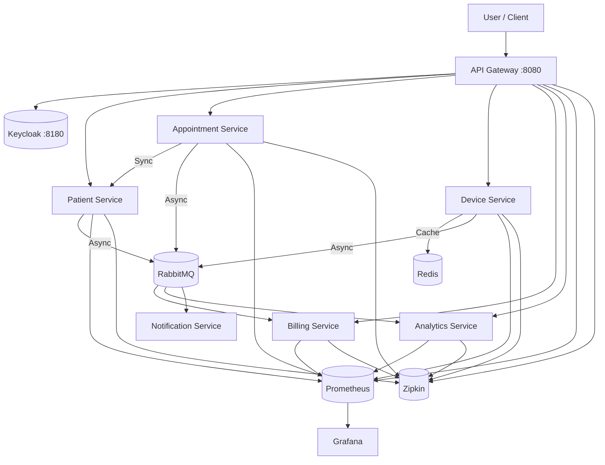

# SmartHealth Platform — Event‑Driven Microservices

## Architecture Overview
The platform consists of 7 microservices communicating via asynchronous events (RabbitMQ) and synchronous REST calls (WebClient). Security is handled by Keycloak (OIDC). Monitoring is provided by Prometheus and Grafana.



## Quick Start

### Prerequisites
* Java 21 (OpenJDK)
* Docker & Docker Compose V2

### 1. Build the project
```bash
# Recommended: use verify to generate stubs for integration tests
./mvnw clean verify
```

### 2. Run the platform
```bash
docker compose up --build -d
```

## Tech Stack Highlights
* **Backend**: Java 21, Spring Boot 3.4.x, Spring Cloud Contract
* **Frontend**: Angular 21, Bootstrap 5, Jest 30
* **Messaging**: RabbitMQ (internal.exchange)
* **Data**: PostgreSQL, Redis
* **Observability**: Prometheus, Grafana, Zipkin

### 3. Access
* **Frontend UI**: http://localhost:4200 (Demo Mode: No login required)
* **API Gateway**: http://localhost:8080
* **Grafana**: http://localhost:3000 (Admin: admin/admin)
* **Zipkin**: http://localhost:9411 (Distributed Tracing)
* **Prometheus**: http://localhost:9090
* **RabbitMQ UI**: http://localhost:15672 (guest/guest)

## Testing Telemetry & Analytics
To simulate live health data and observe the anomaly detection system:
1. Run the simulator script:
   ```bash
   ./infra/simulator.sh
   ```
2. The simulator now includes a **10% chance to trigger an anomaly** (heart rate > 120 BPM).
3. Observe **Live Heart Rate** (Redis cache) and **Analytics & Trends** (PostgreSQL history).
4. Watch `notification-service` logs for **Medical Alerts**:
   ```bash
   docker compose logs -f notification-service
   ```

## Infrastructure Details
* **Observability**: Each service exports metrics to Prometheus and traces to Zipkin. Grafana is pre-configured with JVM dashboards via provisioning.
* **Security (Demo Mode)**: Currently, the platform operates with open access for easier testing. OIDC/Keycloak is available in the infrastructure but redirection is disabled in this branch.
* **Memory Management**: Services are limited to **256MB-512MB RAM** to ensure stability on developer machines.

## Services & Ports
* `api-gateway`: 8080
* `patient-service`: 8081
* `appointment-service`: 8082
* `billing-service`: 8083
* `notification-service`: 8084
* `device-service`: 8085
* `analytics-service`: 8086
