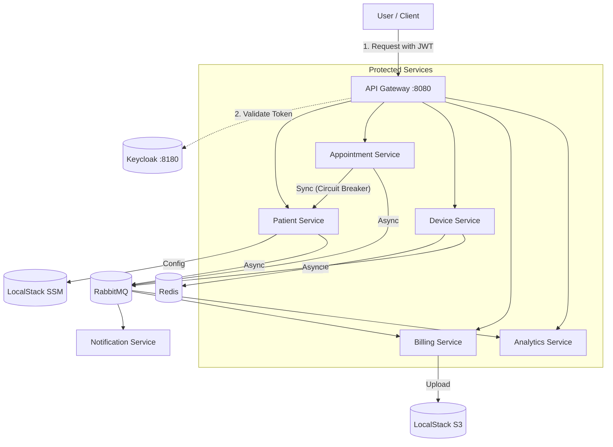
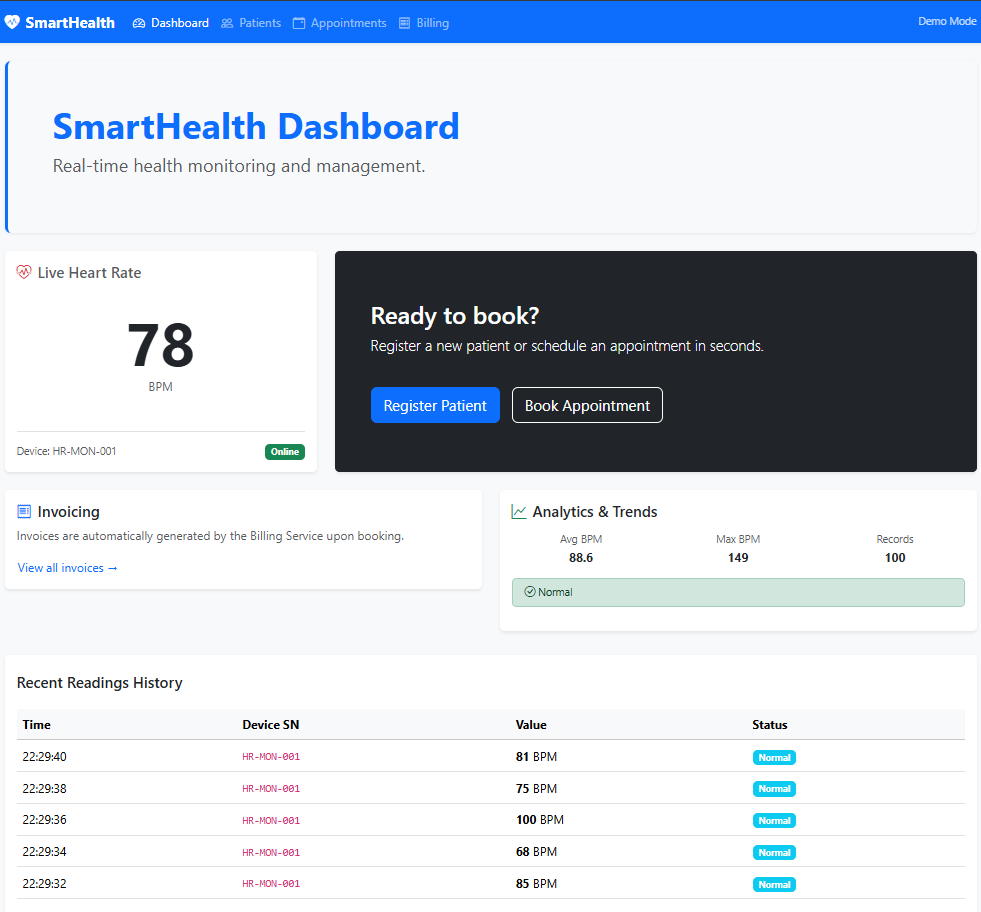
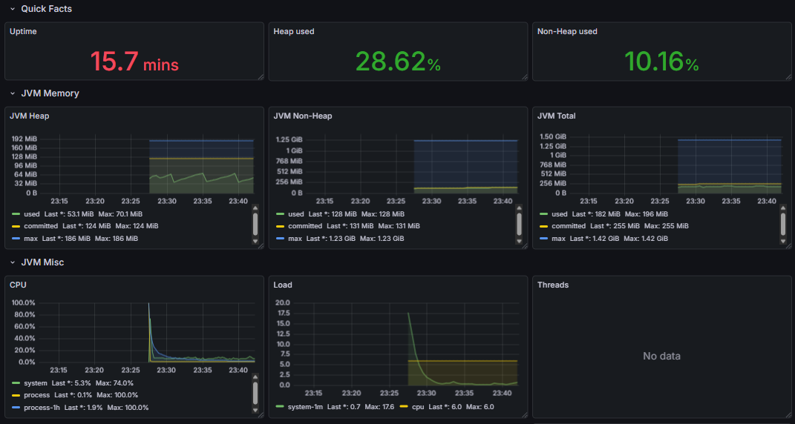

# SmartHealth Platform — Event‑Driven Microservices

## Architecture Overview
The platform consists of 7 microservices communicating via asynchronous events (RabbitMQ) and synchronous REST calls (WebClient with **Resilience4j**). Security is enforced by the **API Gateway** acting as an OAuth2 Resource Server, validating tokens with **Keycloak**.



## Screenshots

### Patient Dashboard


### System Monitoring (Grafana)


## Quick Start

### Prerequisites
* Java 21 (OpenJDK)
* Docker & Docker Compose V2

### 1. Build the project
> **Important:** To run tests successfully, you MUST run `install` or `verify` first to generate necessary stubs.
> Running `mvnw test` directly on a fresh clone will fail because dependent stubs won't exist yet.

```bash
# Recommended: use verify to generate stubs for integration tests (requires install for multi-module resolution)
./mvnw clean install -DskipTests
```

### 2. Run the platform
```bash
docker compose up --build -d
```

## Tech Stack Highlights
* **Backend**: Java 21, Spring Boot 3.4.x, Spring Cloud Contract
* **Cloud**: AWS S3, AWS Parameter Store (via LocalStack)
* **Resilience**: Resilience4j (Circuit Breakers)
* **Frontend**: Angular 21, Bootstrap 5, Jest 30
* **Messaging**: RabbitMQ (internal.exchange)
* **Data**: PostgreSQL, Redis
* **Observability**: Prometheus, Grafana, Zipkin

### 3. Access
* **Frontend UI**: http://localhost:4200 (Read-only access, login required for booking/registration)
* **Grafana**: http://localhost:3000 (Admin: admin/admin)
* **Zipkin**: http://localhost:9411 (Distributed Tracing)
* **Prometheus**: http://localhost:9090
* **RabbitMQ UI**: http://localhost:15672 (guest/guest)
* **LocalStack**: http://localhost:4566

## Testing Telemetry & Analytics
To simulate live health data and observe the anomaly detection system:
1. Run the simulator script:
   ```bash
   ./infra/simulator.sh
   ```
2. The simulator now includes a **10% chance to trigger an anomaly** (heart rate > 120 BPM).
3. Observe **Live Heart Rate** (Redis cache) and **Analytics & Trends** (PostgreSQL history).
4. Watch `notification-service` logs for **Medical Alerts**:
   ```bash
   docker compose logs -f notification-service
   ```

## Infrastructure Details
* **Observability**: Each service exports metrics to Prometheus and traces to Zipkin. Grafana is pre-configured with JVM dashboards via provisioning.
* **Security**: The platform enforces **OAuth2/JWT** authentication via the API Gateway for all state-changing operations (POST, PUT, DELETE). Public access is restricted to read-only (GET) operations for the dashboard.
* **Memory Management**: Services are limited to **256MB-512MB RAM** to ensure stability on developer machines.

## Services & Ports
* `api-gateway`: 8080
* `patient-service`: 8081
* `appointment-service`: 8082
* `billing-service`: 8083
* `notification-service`: 8084
* `device-service`: 8085
* `analytics-service`: 8086
