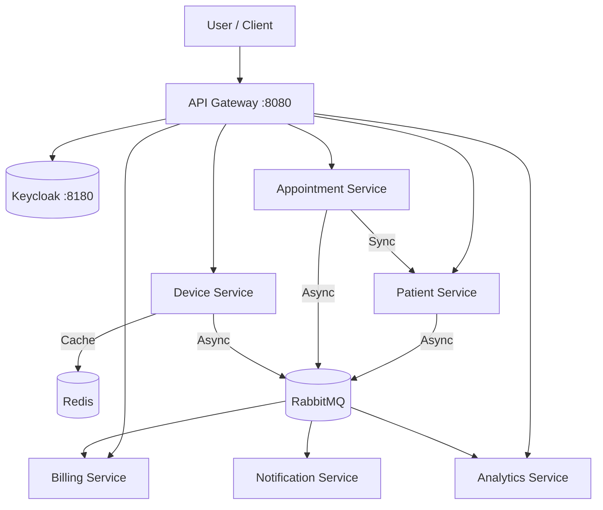

# SmartHealth Platform — Event‑Driven Microservices

## Architecture Overview
The platform consists of 7 microservices communicating via asynchronous events (RabbitMQ) and synchronous REST calls (WebClient). Security is handled by Keycloak (OIDC).



## Quick Start

### Prerequisites
* Java 21 (OpenJDK)
* Docker & Docker Compose V2

### 1. Build the project
```bash
./mvnw clean package -DskipTests
```

### 2. Run the platform
```bash
docker compose up --build -d
```

### 3. Access
* **API Gateway**: http://localhost:8080 (secured via OIDC)
* **Keycloak**: http://localhost:8180 (Admin: admin/admin)
* **RabbitMQ UI**: http://localhost:15672 (guest/guest)

## Infrastructure Details
* **Database**: Consolidated PostgreSQL instance (Port 5432).
* **Caching**: Redis (Port 6379).
* **Memory Management**: Each service is limited to **256MB RAM** to ensure stability on developer machines.

## Services & Ports
* `api-gateway`: 8080
* `patient-service`: 8081
* `appointment-service`: 8082
* `billing-service`: 8083
* `notification-service`: 8084
* `device-service`: 8085
* `analytics-service`: 8086