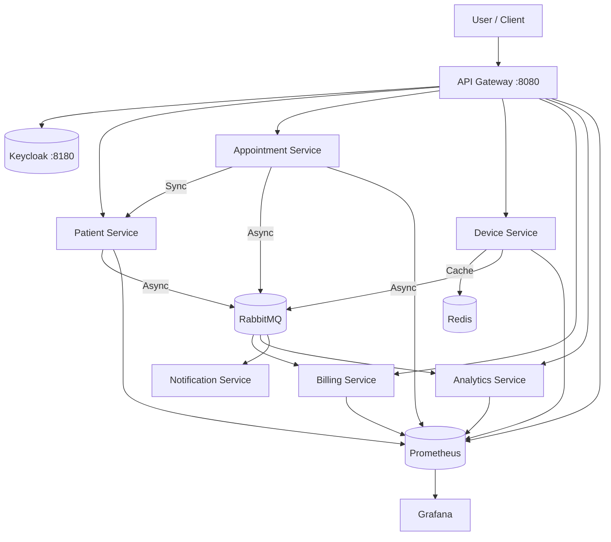

# SmartHealth Platform — Event‑Driven Microservices

## Architecture Overview
The platform consists of 7 microservices communicating via asynchronous events (RabbitMQ) and synchronous REST calls (WebClient). Security is handled by Keycloak (OIDC). Monitoring is provided by Prometheus and Grafana.



## Quick Start

### Prerequisites
* Java 21 (OpenJDK)
* Docker & Docker Compose V2

### 1. Build the project
```bash
./mvnw clean package -DskipTests
```

### 2. Run the platform
```bash
docker compose up --build -d
```

### 3. Access
* **API Gateway**: http://localhost:8080 (secured via OIDC)
* **Keycloak**: http://localhost:8180 (Admin: admin/admin, Realm: smarthealth)
* **Grafana**: http://localhost:3000 (Admin: admin/admin)
* **Prometheus**: http://localhost:9090
* **RabbitMQ UI**: http://localhost:15672 (guest/guest)

## Testing Telemetry
To simulate heart rate monitor data, run the following script in a separate terminal:
```bash
./infra/simulator.sh
```
The Dashboard will automatically pick up the data and update its status from "Waiting for sensor..." to "Online".

## Infrastructure Details
* **Observability**: Each service exports metrics to Prometheus via Spring Boot Actuator. Grafana is pre-configured to visualize JVM state.
* **Security**: Automatic OIDC realm import for Keycloak on startup.
* **Memory Management**: Services are limited to **256MB-512MB RAM** to ensure stability on developer machines.

## Services & Ports
* `api-gateway`: 8080
* `patient-service`: 8081
* `appointment-service`: 8082
* `billing-service`: 8083
* `notification-service`: 8084
* `device-service`: 8085
* `analytics-service`: 8086
